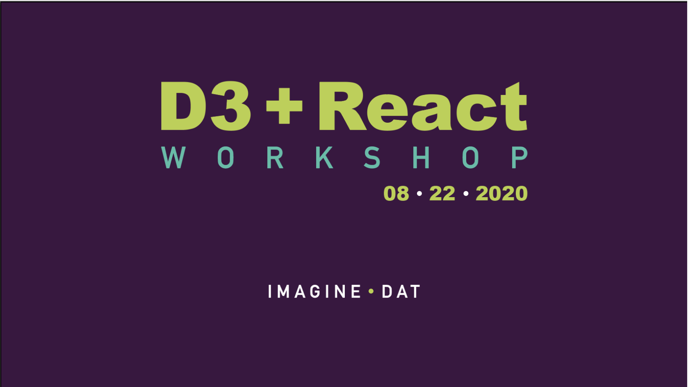

    

# D3 + React Workshop

Data visualization is not just a graph or a chart, but the experimentation of different media to curate and display a collection of data. D3 is a powerful and flexible tool that allows you to create complex and imaginative representations. React, on the other hand, is a JavaScript library that helps you build user interfaces. D3 combined with React opens a lot of possibilities when creating an interactive web application, however, these two technologies are not easily combined as they both handle the DOM.

This repository supports a free, online workshop hosted by [Imagine Dat](http://www.imagine-dat.com/) on August 22nd, 2020.

---

## Clone and run this project

Go to your terminal and use the following command to clone:

`git clone https://github.com/imagine-dat/d3-react-advanced.git`

A folder called **d3-react-advanced** has been created. 
Enter this directory with the following command:

`cd d3-react-advanced`

This project was bootstrapped with [Create React App](https://github.com/facebook/create-react-app) so you will need to install some dependencies to run it:

`npm install`

Run the app in development mode:

`npm start`

Open [http://localhost:3000](http://localhost:3000) to view it in the browser.

The page will reload if you make edits. 
You will also see any lint errors in the console.

---

## Branches

This project has been structured with multiple branches so you are able to view the creation of the App in steps!

By default you are going to be in the `master` branch, which will contain the final product. 

To have access to the the steps:

`git fetch`

and then using the `git checkout` command followed by the `branch-name`.

`git checkout 01-get-data`

### All branches available:
- 01-get-data
- 02-bubble-chart
- 03-get-second-dataset
- 04-selected-pokemon

For my section, to accomodate for time I recommend following along with the master branch rather than building outright.

---

## About Imagine Dat

    

This free, online workshop was hosted by [Imagine Dat](http://www.imagine-dat.com/). 

We are a group of creative visualizers of collected data! If you enjoy presenting data in a creative and impassioned way, you are in the right place. We host community events to share our work, discuss our ideas, teach others new skills, and network with other members of the tech community.

Subscribe to our [mailing list](http://www.imagine-dat.com/mailing_list/) to keep up with future events.

### Follow us on social media

- **Twitter:** [@imagine_dat_dyt](https://twitter.com/imagine_dat_dyt)
- **IG:** [@imagine_dat_dyt](https://www.instagram.com/imagine_dat_dyt/)

### Presenters

    

<table border="0" width=100% align="center">
 <tr>
    <td><b style="font-size:24px; padding-right:1em"></b></td>
    <td><b style="font-size:24px; padding-right:1em">Ren Estep</b></td>
    <td><b style="font-size:24px">Milu Franz</b></td>
 </tr>
 <tr>
    <td>
        
Site:

        
Dev:

        
Twitter:

        
Github:

        
Codepen:

    </td>
    <td>
        
<a href="http://renestep.com/">renestep.com</a>

        
<a href="https://dev.to/stories_of_ren">@stories_of_ren</a>

        
<a href="https://twitter.com/stories_of_ren">@stories_of_ren</a>

        
<a href="https://github.com/nrenc027">nrenc027</a>

        
<a href="https://codepen.io/ren_estep">@ren_estep</a>

    </td>
    <td>
        
<a href="http://milufranz.com/">milufranz.com</a>

        
<a href="https://dev.to/milu_franz">@milu_franz</a>

        
<a href="https://twitter.com/milu_franz">@milu_franz</a>

        
<a href="https://github.com/milufranz08">milufranz08</a>

        
<a href="https://codepen.io/Milu5489">@Milu5489</a>

    </td>
 </tr>
</table>

## How to start the React + D3 advanced App
-------------------------------------------------------------------------

This project was bootstrapped with [Create React App](https://github.com/facebook/create-react-app).

## Available Scripts

In the project directory, you can run:

### `npm start`

Runs the app in the development mode. 
Open [http://localhost:3000](http://localhost:3000) to view it in the browser.

The page will reload if you make edits. 
You will also see any lint errors in the console.

### `npm test`

Launches the test runner in the interactive watch mode. 
See the section about [running tests](https://facebook.github.io/create-react-app/docs/running-tests) for more information.

### `npm run build`

Builds the app for production to the `build` folder. 
It correctly bundles React in production mode and optimizes the build for the best performance.

The build is minified and the filenames include the hashes. 
Your app is ready to be deployed!

See the section about [deployment](https://facebook.github.io/create-react-app/docs/deployment) for more information.

### `npm run eject`

**Note: this is a one-way operation. Once you `eject`, you can’t go back!**

If you aren’t satisfied with the build tool and configuration choices, you can `eject` at any time. This command will remove the single build dependency from your project.

Instead, it will copy all the configuration files and the transitive dependencies (webpack, Babel, ESLint, etc) right into your project so you have full control over them. All of the commands except `eject` will still work, but they will point to the copied scripts so you can tweak them. At this point you’re on your own.

You don’t have to ever use `eject`. The curated feature set is suitable for small and middle deployments, and you shouldn’t feel obligated to use this feature. However we understand that this tool wouldn’t be useful if you couldn’t customize it when you are ready for it.

## Learn More

You can learn more in the [Create React App documentation](https://facebook.github.io/create-react-app/docs/getting-started).

To learn React, check out the [React documentation](https://reactjs.org/).

### Code Splitting

This section has moved here: https://facebook.github.io/create-react-app/docs/code-splitting

### Analyzing the Bundle Size

This section has moved here: https://facebook.github.io/create-react-app/docs/analyzing-the-bundle-size

### Making a Progressive Web App

This section has moved here: https://facebook.github.io/create-react-app/docs/making-a-progressive-web-app

### Advanced Configuration

This section has moved here: https://facebook.github.io/create-react-app/docs/advanced-configuration

### Deployment

This section has moved here: https://facebook.github.io/create-react-app/docs/deployment

### `npm run build` fails to minify

This section has moved here: https://facebook.github.io/create-react-app/docs/troubleshooting#npm-run-build-fails-to-minify
